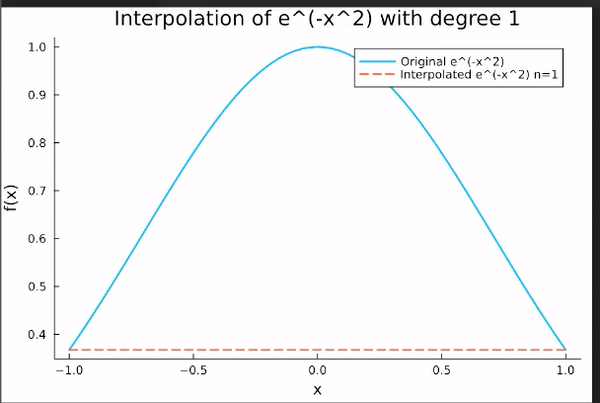
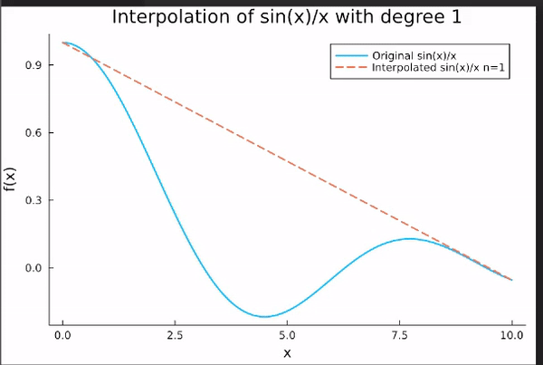
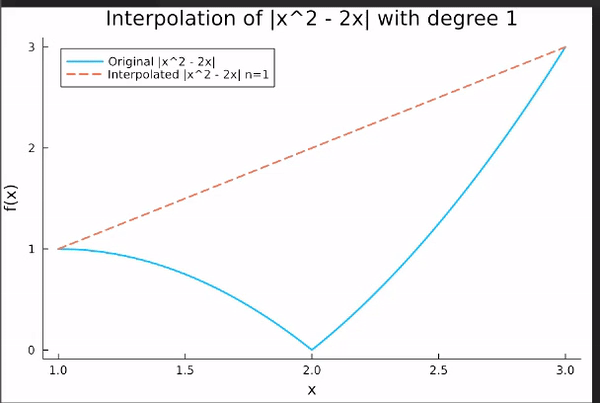

# Interpolation with the barycentric formula

This is the documentation for the repository of homework 3 Interpolation with the barycentric formula of the course Numerical Methods. This documentation is devided in two parts: the first one is the documentation of the mathematical backround of the task and the second part is the documentation of the code we used to solve the task.

## Mathematical backround 

### Introduction
The point of the given task is to numerically interpolate the following function: e^(-x^2)  on \([-1,1]\) , sin(x)/x  on \([0,10]\) and |x^2-2x|  on \([1,3]\). The interpolation is done with the barycentric formula and Chebyshev points. 

### Chebyshev points
Chebyshev points are the roots of the Chebyshev polynomials. The Chebyshev polynomials are defined as a sequence of orthogonal polynomials defined on the interval [−1,1].

Chebyshev points of the first kind in the interval [−1,1] are given by the formula:

<table align="center">
    <tr>
        <td>
            
        </td>
    </tr>
</table>

And for the Chebyshev points on the interval [a, b]:

<table align="center">
    <tr>
        <td>
            
        </td>
    </tr>
</table>

### Barycentric formula
The barycentric formula is a method for numerical interpolation. It is based on the Lagrange interpolation formula. The Lagrange interpolation formula is the following:

<table align="center">
    <tr>
        <td>
            
        </td>
    </tr>
</table>

But this formula is numerically unstable, so we use the barycentric formula instead. The barycentric formula is the following:

<table align="center">
    <tr>
        <td>
            
        </td>
    </tr>
</table>

This formula offers a numerically stable way to interpolate a function and it is also faster than the Lagrange interpolation formula.

### The results of the interpolation
The following pictures show the results of the interpolation of the given functions with the barycentric formula and Chebyshev points.

1. e^(-x^2)
<p align="center">
  
</p>

2. sin(x)/x 
<p align="center">
  
</p>

3. |x^2-2x|
<p align="center">
  
</p>

## Code documentation
First we calculate the Chebyshev nodes using the second formula for the Chebyshev points. We use the following function to calculate the Chebyshev nodes:

```julia 
function chebyshev_nodes(n, a, b)

    # Check the nodes calculation
    nodes = [cos(π * (i / n)) for i in 0:n]
    
    # Check the mapping to the interval
    mapped_nodes = [(a + b) / 2 + (b - a) / 2 * x for x in nodes]
   
    return mapped_nodes
end
```
Next we calculate the weights for the barycentric formula. We use the following function to calculate the weights:

```julia
function chebyshev_weights(n)
    weights = [Float64((-1)^i) for i in 0:n]
    weights[1] *= 0.5
    weights[end] *= 0.5
    return weights
end
```
After that we can caculate the barycentric interpolation using the barycentric formula. We use the following function to calculate the barycentric interpolation:
```julia
function barycentric_interpolation(nodes,values, weights, x)
   if x in nodes
        return values[nodes .== x][1]
    else
         # Calculate the numerator
         numerator = sum(values[i] * weights[i] ./ (x .- nodes[i]) for i in 1:length(nodes))
         # Calculate the denominator
         denominator = sum(weights[i] ./ (x .- nodes[i]) for i in 1:length(nodes))
    end

    return numerator / denominator
end
```

After we have the barycentric interpolation we can run the code so that we are in the exaptible level of precision. We use the following function to run the code:
```julia
function get_optimal_degree(func, a, b,n,precision)
    while true
        nodes = chebyshev_nodes(n, a, b)
        values = [func(node) for node in nodes]
        weights = chebyshev_weights(n)
        
        test_points = range(a, stop=b, length=1000)
        max_error = 0.0

        for x in test_points
            interpolated_value = barycentric_interpolation(nodes, values, weights, x)
            error = abs(func(x) - interpolated_value)
            max_error = max(max_error, error)
        end

        if max_error < precision
            return n
        end

        n += 1  
    
    end
end
```

Finally we can plot the results of the interpolation. We use the following function to plot the results:
```julia
function plot_interpolation(f, a, b, n, name)
    nodes = chebyshev_nodes(n, a, b)
    values = [f(node) for node in nodes]
    weights = chebyshev_weights(n)
    
    x_vals = range(a, stop=b, length=1000)
    y_true = [f(x) for x in x_vals]
    y_interp = [barycentric_interpolation(nodes, values, weights, x) for x in x_vals]
    
    p = plot(x_vals, y_true, label="Original $name", lw=2)
    plot!(p, x_vals, y_interp, label="Interpolated $name n=$n", linestyle=:dash, lw=2)
    title!("Interpolation of $name with degree $n")
    xlabel!("x")
    ylabel!("f(x)")
    return p
end
```